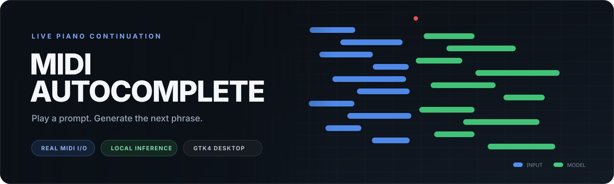

# MIDI Autocomplete

A GTK4 desktop piano-continuation app based on Simon Edwardsson's [MIDI autocomplete write-up](https://simedw.com/2026/08/20/midi-autocomplete/).

## Run

Requirements: GTK4, ALSA development headers on Linux, Rust, and [uv](https://docs.astral.sh/uv/).

```sh
# Train a useful checkpoint first. See midilm/README.md.
cargo run --release
```

1. Select a MIDI keyboard input and a synth or keyboard output. Click **Refresh** after connecting new hardware.
2. Click **Connect**, then **Rec** to capture a prompt. Click **Stop Rec** when the prompt is complete.
3. Set the checkpoint path and performance BPM, then click **Autocomplete**.
4. Choose a `.sf2` SoundFont and click **Play** to replay the full piano roll. **Stop** appears during playback.

The red playhead follows recording and playback on a horizontally scrollable timeline. Play renders the SoundFont through the computer's default audio device and simultaneously sends notes to the connected MIDI output. Blue piano-roll notes are input and green notes come from the model. The app records note duration and folds sustain-pedal time into it before inference.

## Configuration

The app saves the MIDI device selections, model checkpoint, and SoundFont path automatically. On startup it restores them and reconnects when both saved MIDI devices are available. If no model is saved, it uses `midilm/checkpoints/medium.pt`.

```text
~/.config/midi-autocomplete/config.toml
```

`$XDG_CONFIG_HOME` replaces `~/.config` when set.

```toml
midi_input = "Digital Piano MIDI 1"
midi_output = "Digital Piano MIDI 1"
model = "midilm/checkpoints/medium.pt"
soundfont = "/home/user/sounds/piano.sf2"
```
